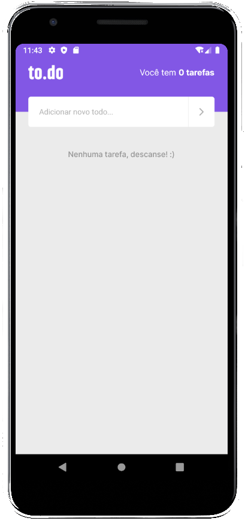
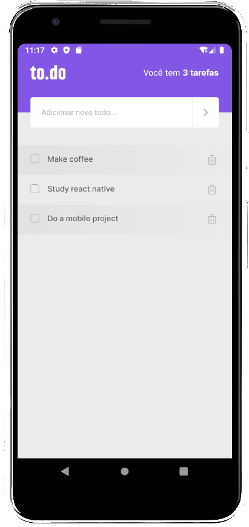
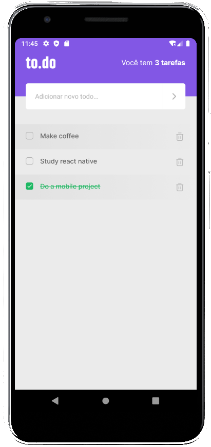

<div align="center">
  <h1>to.do</h1>
  
  
  
  
</div>

## The project

**to.do** is a mobile app developed with React Native for daily tasks. You can add, mark as completed or delete a task.

This is the 1st challenge of Chapter I - Ignite program (React Native trail) delivered to [Rocketseat](https://rocketseat.com.br/).

---

## Layout

<div>
  
  
  
</div>

---

## Technologies and tools

- React Native
- Typescript
- Jest
- Hooks (useState)
- Android Studio

---

## How to run the project?

Make sure you properly configure your iOS or Android emulator before running the app.

```bash
# Clone this repository
$ git clone https://github.com/cunhasbia/todo-mobile.git

# Access the repository on your terminal
$ cd todo-mobile

# Install dependencies
$ yarn

# Run the project
$ yarn run android
$ yarn run ios

# The app will be running on emulator.
```
Need help? Failed to run? Feel free to contact me.

---
<p align="center">Made with :orange_heart: by Bianca Cunha | Find me on <a href="https://www.linkedin.com/in/biancascunha">LinkedIn</a></p>